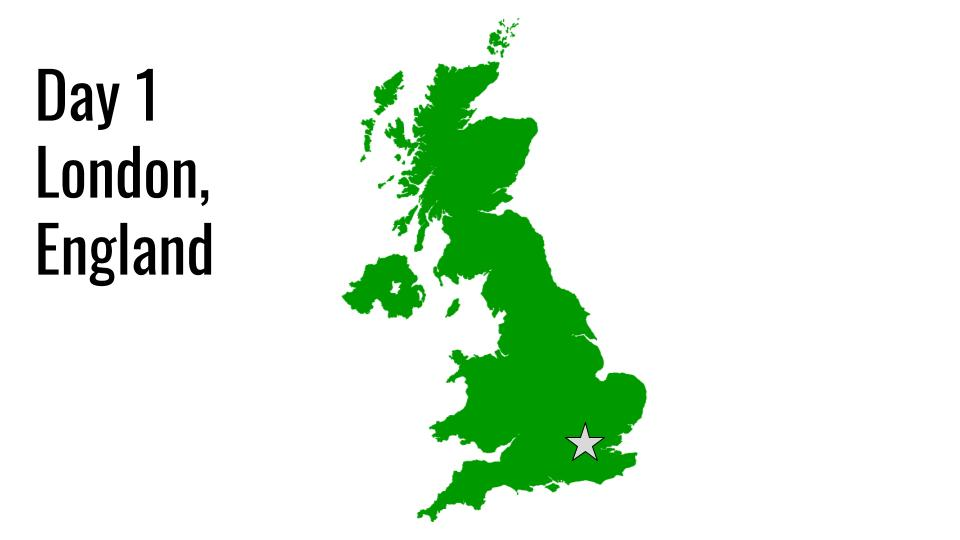
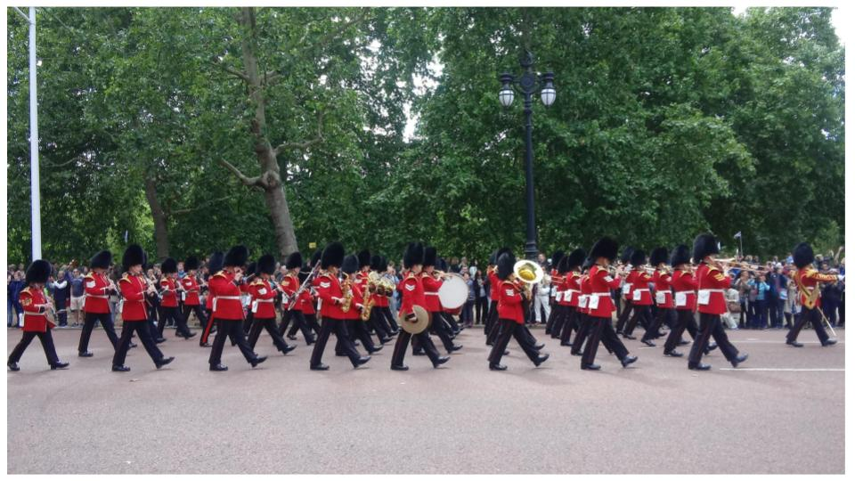
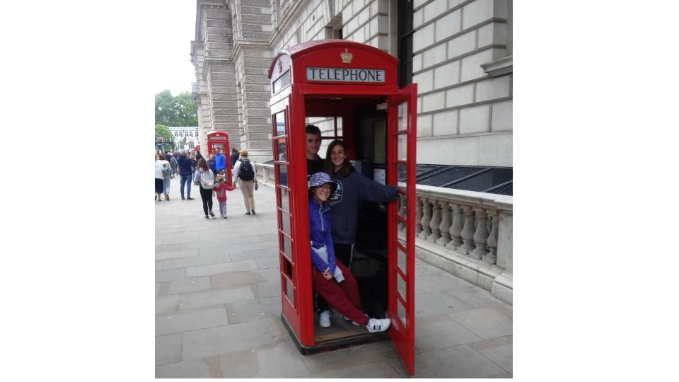
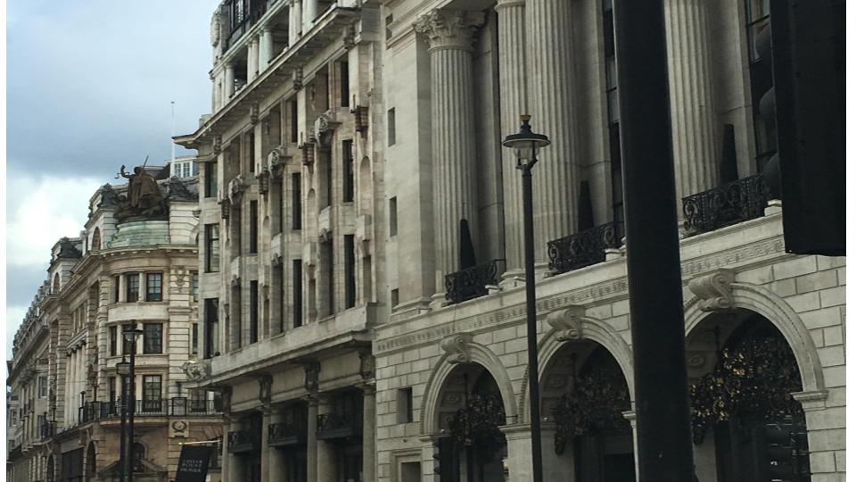

# Let's Get Started

---

---

---

---

---

---

---

---

---

---

---

@title[Customize Slide Layout]

@snap[west span-50]
## Customize the Layout
@snapend

@snap[east span-50]

@snapend

@snap[south span-100 text-white]
Snap Layouts let you create custom slide designs directly within your markdown.
@snapend

---?color=linear-gradient(90deg, #E27924 65%, white 35%)
@title[Add A Little Imagination]

@snap[north-west h4-white]
#### And start presenting...
@snapend

@snap[west span-55]
@ul[spaced text-white]
- You will be amazed
- What you can achieve
- *With a little imagination...*
- And **GitPitch Markdown**
@ulend
@snapend

@snap[east span-45]
@img[shadow](assets/img/conference.png)
@snapend

---?image=assets/img/presenter.jpg

@snap[north span-100 h2-white]
## Now It's Your Turn
@snapend

@snap[south span-100 text-06]
[Click here to jump straight into the interactive feature guides in the GitPitch Docs @fa[external-link]](https://gitpitch.com/docs/getting-started/tutorial/)
@snapend
